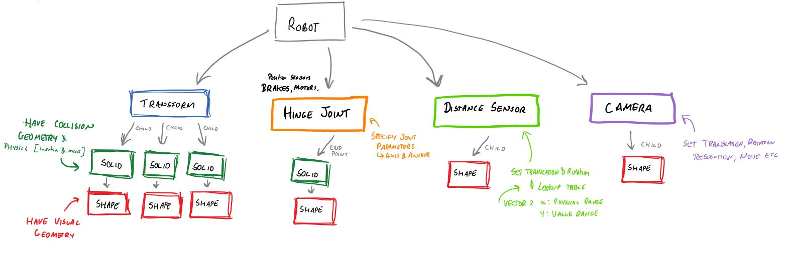
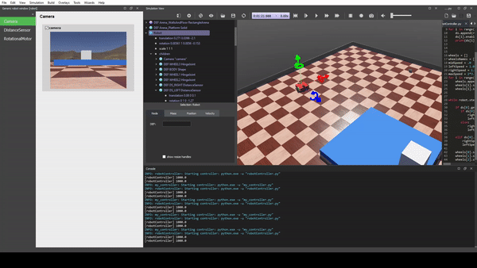
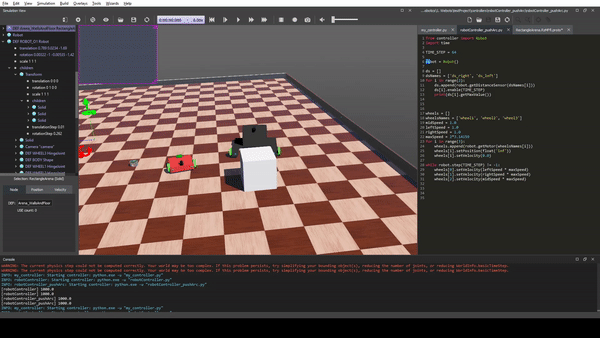

# Robots

## Design Overview

Designing robots in Webots utilises a tree structure - the root node is the Robot Object. 
Only certain nodes can have children, and the number of children allowed is variable. 

The physics engine is dependent on collision geometries (a property of solids)
while the users see visual geometries (properties of shapes). A solid can have a child 
shape while shapes cannot have children.

The collision and visual geometries do not have to be identical, simplified outlines
 (like boxes) should be used for collision to ease the strain on physics simulations. 
 Visual geometries can be made from simple shapes or imported as meshes from CAD applications.
 
When placing a child, its position is relative to the origin of the parent. A transform 
joint can be used to create a new relative origin. A transform joint can be used to group c
hildren for better organisation (in the above diagram it is proposed to group all of the 
robots main body solids).

## Demos

#### 29/04/2020 - Sensor Demo: Collision Avoid
Robot uses two front mounted distance sensors and differential steering to avoid collisions.

#### 29/04/2020 - Physics Demo: Box Push I
Robot blindly pushes a token into the arena wall

#### 30/04/2020 - Physics Demo: Box Push II
Robot drives blindly towards a token, when a token is detected within its 'capture zone' it rotates and pushes the token to a new location. The token is detected with a distance sensor located against the back wall of the 'capture zones'. This Robot is called Arthur.

#### 30/04/2020 - Competition Demo: Multiple Robot Test
Four instances of the robot Arthur are placed within the arena, each running a different script.

 

## Meet The Robots

